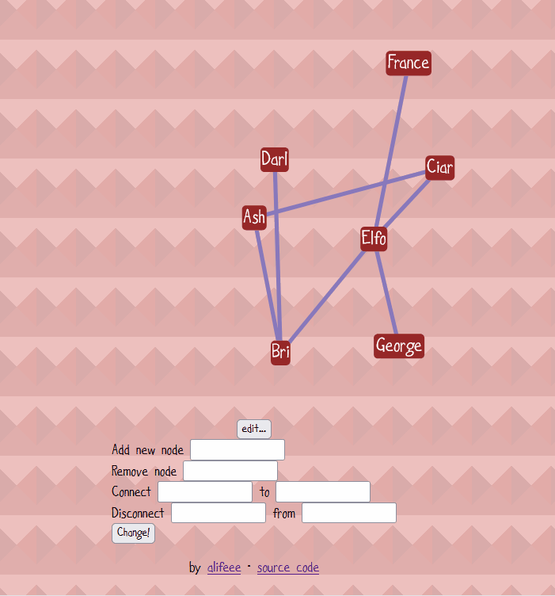

# Polycule Visualiser

A graph visualiser designed to be self-hosted, using [Springy]

See a non-editable example → <http://alifeee.co.uk/polycule-visualiser/>



## How to build site

### Install

Install dependencies & copy site-specific data files.

```bash
cp polycule.json.example polycule.json
nano polycule.json
```

### Build site

We change the ownership of the built files, so that the www-data user can change them later.

```bash
sudo chown $USER:www-data polycule.json
```

## Set up on server

```bash
mkdir -p /var/www/
git clone git@github.com:alifeee/polycule-visualiser /var/www/polycule
```

Generate a password file for the site

```bash
sudo htpasswd -c /etc/nginx/polycule.htpasswd <new_user>
```

Add the following to nginx config (using `fastcgi`)

```nginx
location /polycule/ {
    alias /usr/alifeee/polycule/;
    try_files $uri $uri/ =404;

    auth_basic_user_file /etc/nginx/polycule.htpasswd;
    auth_basic "polycule";
}
location ~ ^(/polycule/edit|/polycule/rss) {
    fastcgi_intercept_errors on;
    include fastcgi_params;
    fastcgi_param SCRIPT_FILENAME /usr/alifeee$fastcgi_script_name;
    fastcgi_pass unix:/var/run/fcgiwrap.socket;

    auth_basic_user_file /var/www/polycule/.htpasswd;
    auth_basic "polycule";
}
```

[Springy]: http://getspringy.com/
